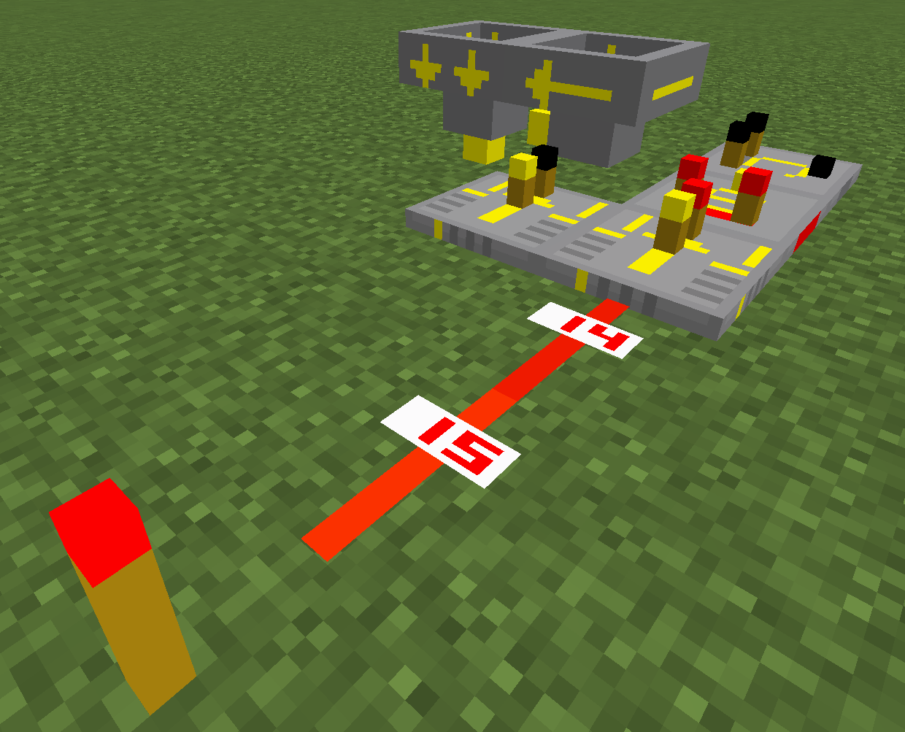

# b-redstone

This is a texture pack for redstoners using Minecraft version 1.15 - 1.21.5. It specifically focuses on improving the redstone components in the game, making them more visually distinct and easier to understand at a glance. It doesn't change any game mechanics or add any new features, but rather enhances the existing ones by providing clearer and more informative textures.

It features new textures for the following blocks:

- **Redstone dust** - it will show the redstone level
- **Redstone torch** - Simpler and much more clear on/off state.
- **Hoppers** - clearly show the direction and the state
- **Redstone lamp** - much brighter when on, much darker when off
- **Repeater** - clearly show the delay
- **Comparator** - clearly show the mode
- **Observer** - clearly show the direction and the state
- **Lever** - clearly show the on/off state
- **Note blocks** - clearly show the note and the instrument

## Install and usage

Download the correct zip-file for your Minecraft version and drop it in your `resourcepacks` directory in your Minecraft folder.

Once you have the zip-file in the `resourcepacks` directory, you can select it in the Minecraft options menu. Go to `Options` -> `Resource Packs`, and you should see the pack listed there. Click on it to move it to the selected packs list, and then click `Done`. The pack will be applied to your game. Please enjoy!
